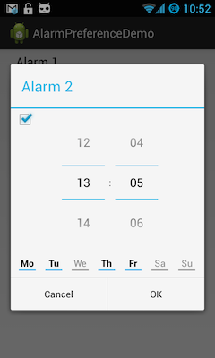

AlarmPreference
===============

This is a custom preference for Android that allows the user to choose a time and days of the week for an event to repeat.

Requires JodaTime.

AlarmPreferences manage Alarm objects, which are parcelable and hold:
* a boolean that tells us if the alarm is enabled 
* the time at which the alarm should ring
* an int which stores bitwise if the alarm is on for every day of the week. Monday is bit 0, Tuesday bit 1, and so on, so an alarm set for every day would
have the value 0x7F or 127 in decimal.

This Alarm is saved to the SharedPreferences as a JSONObject.

##Usage

Add an AlarmPreference to your preference xml like this:

    <PreferenceScreen xmlns:android="http://schemas.android.com/apk/res/android" >
		<com.guavabot.alarmpreference.AlarmPreference
				android:key="Alarm_1"
				android:title="Alarm 1" />
	</PreferenceScreen>

To retrieve an Alarm from the SharedPreferences:

	Alarm myAlarm = new Alarm(sharedPreferences.getString("Alarm_1", null));

You can check if an alarm is activated certain day like this:

	if (myAlarm.isAlarmOn() && myAlarm.isDayAlarm(Alarm.Monday)) {
		//do something
	}
    
Or you can calculate when the alarm should go off using `getNextTrigger()`, which will return the trigger time as a UNIX timestamp.

The AlarmPreference has a method `setAlarm(Alarm)` if you want to initialize it in your PreferenceActivity.